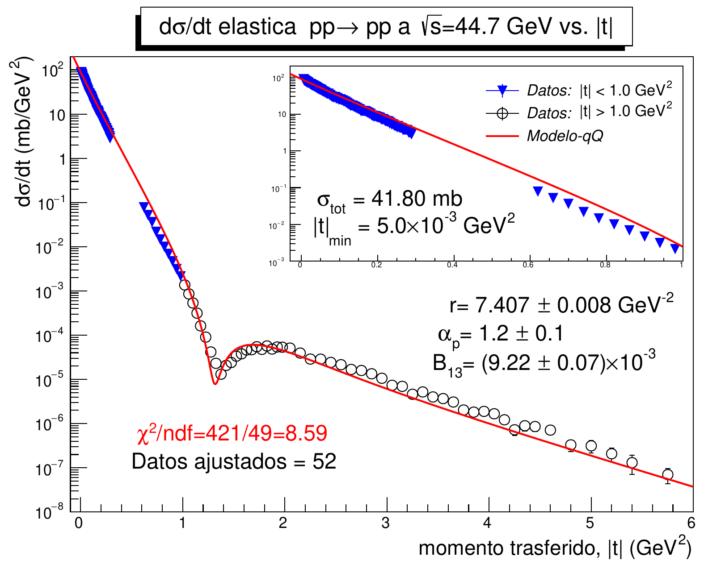

# Modelo Quark-Diquark para Dispersión Elástica Protón-Protón

Este proyecto presenta un modelo teórico basado en la estructura de quarks y diquarks para describir la dispersión elástica entre protones. 
Se propone un enfoque que incluye la normalización global de las amplitudes de dispersión, con el fin de entender mejor las interacciones nucleares a altas energías.

## Resumen del Artículo

El modelo quark-diquark es una aproximación que ayuda a simplificar el análisis de interacciones fuertes en la física de partículas. 
Este enfoque se centra en cómo los protones, compuestos por quarks y gluones, interactúan entre sí a través de la dispersión elástica. 
Se estudian diferentes configuraciones de estos componentes para extraer información sobre las fuerzas fundamentales que rigen el comportamiento de la materia a escalas subatómicas.

### Objetivos

- **Desarrollar un marco teórico** que explique la dispersión de protones utilizando el modelo quark-diquark.
- **Implementar técnicas de normalización** para mejorar la precisión de las predicciones del modelo.
- **Comparar resultados teóricos con datos experimentales** disponibles para validar la efectividad del modelo.

### Metodología

1. **Definición del modelo**:
   - Establecimiento de las propiedades de quarks y diquarks.
   - Descripción de las interacciones entre quarks dentro de los protones.

2. **Cálculo de amplitudes**:
   - Derivación de las amplitudes de dispersión utilizando técnicas de teoría cuántica de campos.
   - Análisis de la estructura de los protones en función de sus componentes internos.

3. **Normalización global**:
   - Aplicación de un esquema de normalización que se adapta a las condiciones experimentales.
   - Evaluación de la consistencia de las amplitudes calculadas con respecto a observables medibles.

4. **Validación**:
   - Comparación de las predicciones del modelo con datos experimentales de dispersión de protones.
   - Análisis estadístico para evaluar la calidad del ajuste utilizando el paquete **Minuit** en combinación con **ROOT/CERN**.

## Resultados

Los resultados del modelo quark-diquark muestran una buena concordancia con los datos experimentales de dispersión elástica a altas energías. Las amplitudes calculadas se alinean con las observaciones, lo que sugiere que este enfoque puede ser efectivo para describir las interacciones nucleares.

# Imágenes de la Tesis

Aquí están las imágenes generadas:

    

        
    

    

        
    

    

        
    

    

        
    

    

        
    

    

        
    

    

        
    

    

        
    

    

        
    

    

        
    

    

        
    

    

        
    

    

        
    

    

        
    

    

        
    

    

        
    

    

        
    

    

        
    

    

        
    

    

        
    

## Conclusiones

El modelo quark-diquark, con la implementación de la normalización global, proporciona una herramienta útil para el estudio de las interacciones protones-protones. Los hallazgos destacan la importancia de considerar la estructura interna de los protones para entender mejor las dinámicas de las colisiones a altas energías.

## Instalación

Para ejecutar las simulaciones y análisis propuestos en este proyecto, se requiere el siguiente entorno:

- **Python 3.x**
- **Bibliotecas**: NumPy, SciPy, Matplotlib
- **Paquetes adicionales**: Minuit y ROOT/CERN

Mas información aquí:
https://revistas.unal.edu.co/index.php/rfc/article/view/77604

